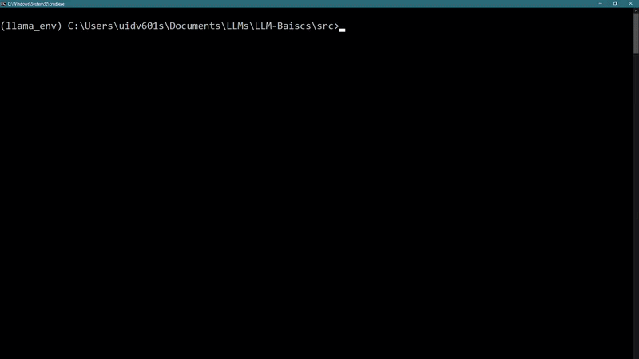
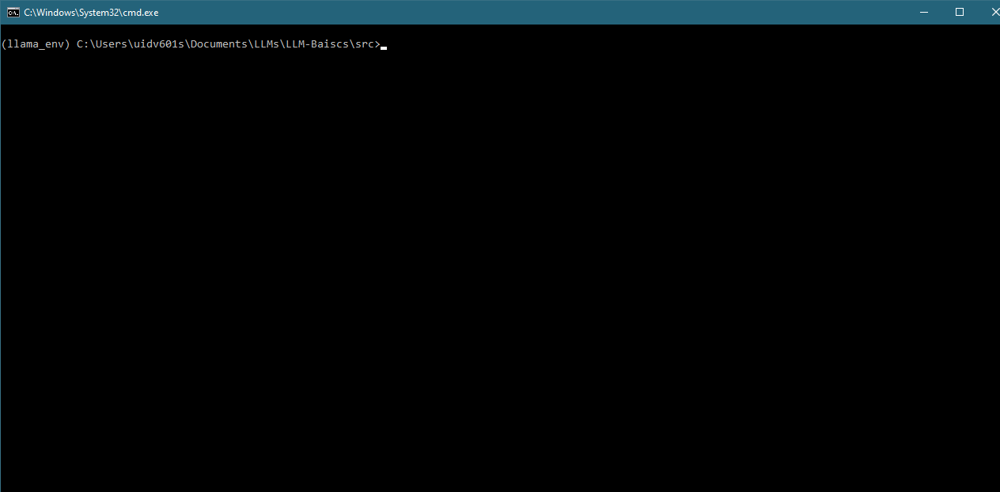

# LLM-Inference-Playbook
### Serverless to Edge with KV Caching &amp; Cost Optimization

[](https://www.python.org/downloads/)
[](https://huggingface.co/models)
[](https://huggingface.co/docs/api-inference/index)
[](https://huggingface.co/Qwen/Qwen2.5-7B-Instruct-1M)
[](https://huggingface.co/meta-llama/Llama-2-7b-chat-hf)
[](https://huggingface.co/google/gemma-3-4b-it)
[](https://github.com/huggingface/transformers)

---
This repository is a hands-on playbook for understanding and optimizing Large Language Model (LLM) inference across different deployment settings — from Hugging Face serverless APIs to fully local execution on GPU/CPU.

The focus of this project goes beyond basic inference. It explores how real-world LLM systems are built and optimized with respect to latency, memory, context handling, and compute cost.

## 🚀 What this repo covers

- 🔹 Serverless LLM inference using Hugging Face APIs (free tier friendly)
- 🔹 Local LLM inference with open-source models (GPU/CPU setups)
- 🔹 Chat vs stateless inference (with and without history)
- 🔹 KV Caching for faster autoregressive decoding
- 🔹 Context window management and prompt structuring
- 🔹 Compute and memory optimization techniques
- 🔹 Practical trade-offs: latency vs cost vs quality
---
### 🧪 Stateless vs Stateful Behavior

**Input sequence:**
1. What is the capital of France?  
2. How many airports are there in Paris?  
3. How is the weather in the month of June?  

- **`01-Basic.py` (Stateless):** Treats each query independently → asks for location clarification in Q3  
- **`03-Chat_History.py` (Stateful):** Maintains context → correctly infers the weather query refers to *Paris*  

👉 Demonstrates the importance of chat history for contextual understanding in multi-turn conversations.
---
### [01-Basic.py](./src/01-Baisc.py)
Demonstrates minimal LLM inference using Hugging Face’s serverless Inference API. It shows how to send a prompt, receive a generated response, and build a simple interactive loop. 
- This script serves as the entry point for understanding stateless LLM inference without history, caching, or optimization.
<p align="center">
  
</p>
▶️ Execution
   
    python ./src/01-Basics.py


### [02-Basic_Pro.py](./src/02-Basic_Pro.py) 
- Enhanced LLM inference with streaming responses. Intended to make the response/UX realtime. 
<!--
<p align="center">
  
</p>
-->

### [03-Chat_History.py](./src/03-Chat_History.py)
- Demonstrates stateful LLM interaction by maintaining chat history across turns, enabling multi-turn conversations with contextual continuity.
<p align="center">
  
</p>

---
# Advanced Concept (KV_Caching)

### [chat_kv_cache.py](./KV_Caching/src/chat_kv_cache.py): 
- Implements chat-based LLM inference using **KV caching**, where the model stores **token-level key/value states (not raw text)** from previous turns.
- This avoids recomputing attention over the full history, leading to **lower latency, reduced compute cost, and improved throughput** in multi-turn conversations.

### 🔄 KV Cache Flow
   ```bash
   Text → Tokens → Transformer (K, V states) → KV Cache  
                                            ↓  
                            Next Token Generation (reuse KV)
  ```

**Key idea:** Cache grows with tokens, enabling fast incremental decoding without reprocessing past context.

▶️ Execution
   
    python ./KV_Caching/main.py
  
---
## 🛠 Setup and Installation

1. **Clone the repository:**
   ```bash
   git clone [https://github.com/Kishore4c9/LLM-Inference-Playbook.git](https://github.com/Kishore4c9/LLM-Inference-Playbook.git)
   cd LLM-Inference-Playbook

2. **Environment:**
 Create Virtual Env
   ```bash
   $ python3 -m venv .venv
   $ source .venv/bin/activate
3. Install requirements.txt
   ```bash
   $ pip install -r requirements.txt

---
